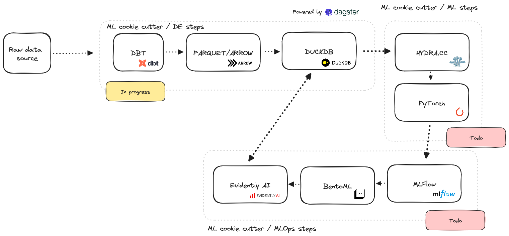

# ml-cookie-cutter
Base tooling for ML projects from data ingress to model performance monitoring. Using an ELT design pattern for data ingress to version, snapshot, observe and otherwise transform "raw" input data.



## Get started

See `Development container`, all setup should be included. If not,

```
poetry install
git lfs pull
```

## Behavioural applications

### Data

List projects
```
ml list
```

### ML

train models using

```
ml experiment dataset=amazing_dataset_v1 model=ts_trs_small
```

### Ops

```
ml build --run-name incredible-crane-313
```


### Development notes

#### Development container

The repository contains a dev container for vscode with all necessary dependencies. Thus, for any development, I'd recommend Vscode.

#### Github actions

Github actions can be run locally with 

```
act
```


